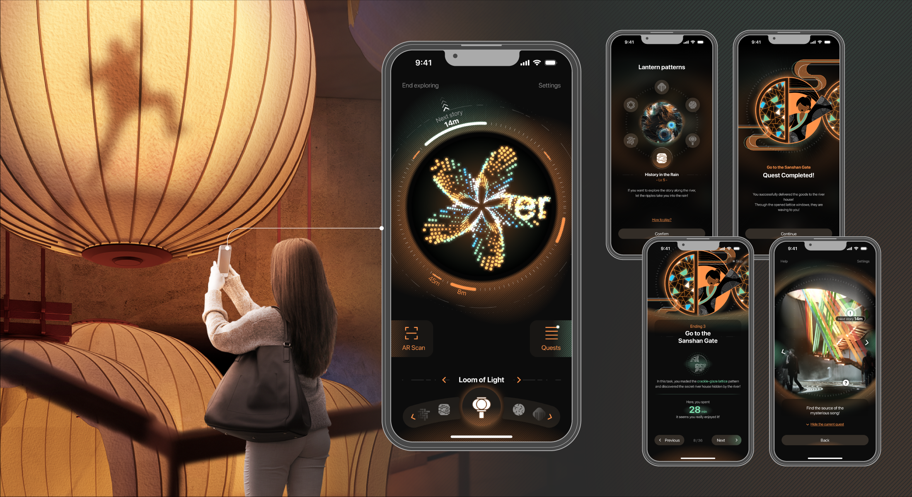

## Interactive Virtual Lantern Pattern

#### Introduction

A simple Processing program as a part of a spatial and interactive design project ***Explore in Virtual Light***.

In this project, I designed a gamified exhibition hall combining physical space with digital media to show Qinhuai culture. Users can not only interact directly with the interactive installation and media in the space, but interact with the exhibition through the virtual lantern patterns in a companion app.

#### Details

This program can show artistic, dynamic and interactive patterns, realizing the virtual lantern patterns designed in the project.

It currently has following two modules. Both of them correspond to a thematic virtual lantern pattern.

**History in the Rain**

This module includes a dynamic flow field pattern generated by noise. Users can touch the pattern to create ripples and disrupt the flow field.

In the real exhibition, users can interact with the water curtain in the space in this way.

**Lantern Riddles**

This module includes a random geometric pattern composed of waving points. Users can touch the pattern, and the points near the touch point will form texts to reveal hidden lantern riddle answers.

In the real exhibition, users can get hints for lantern riddles in this way.

